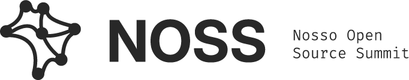
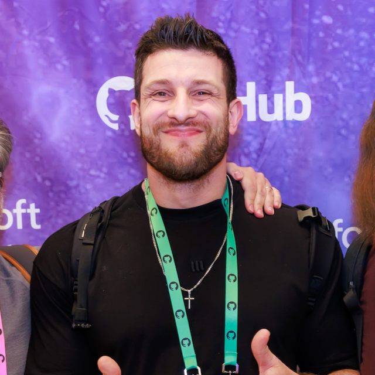
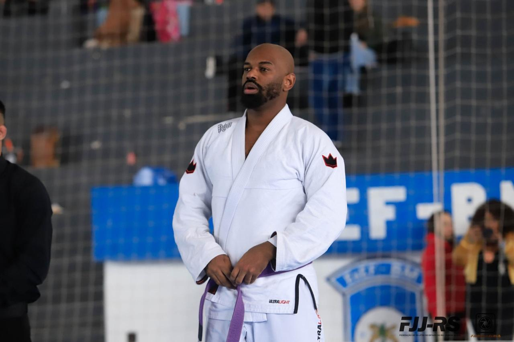
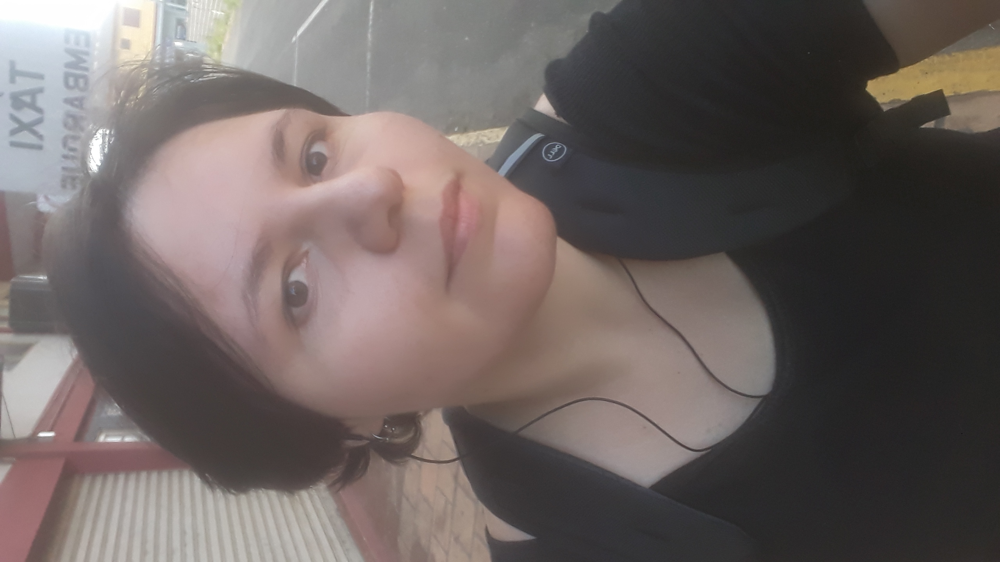
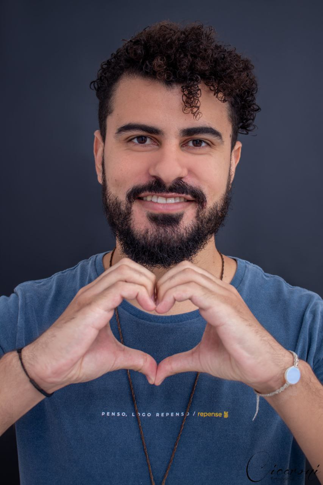
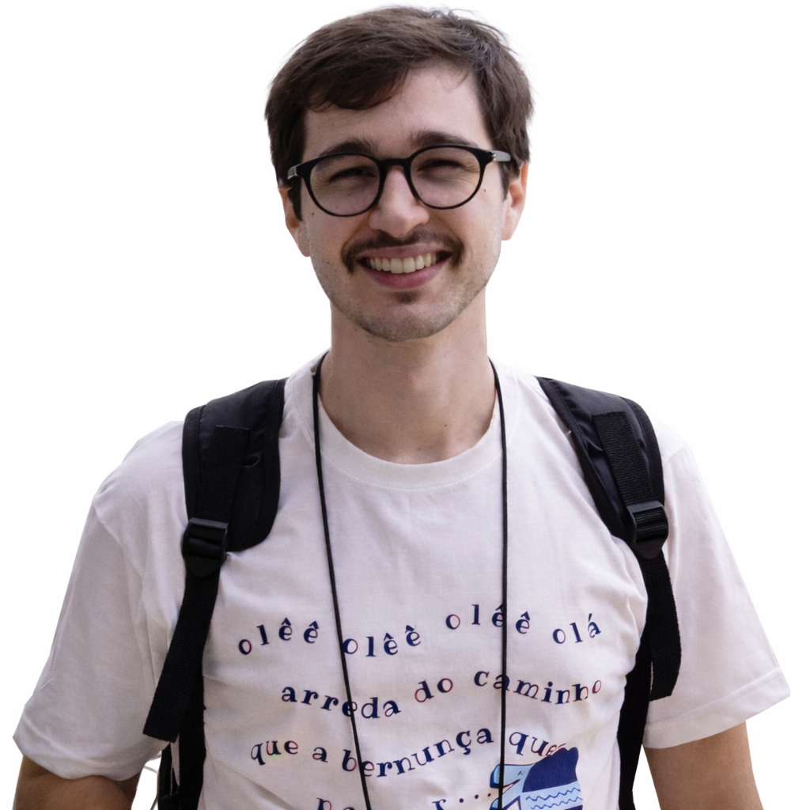
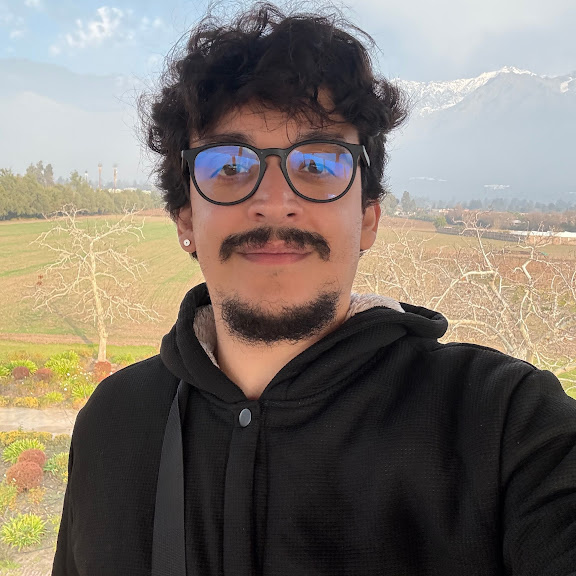
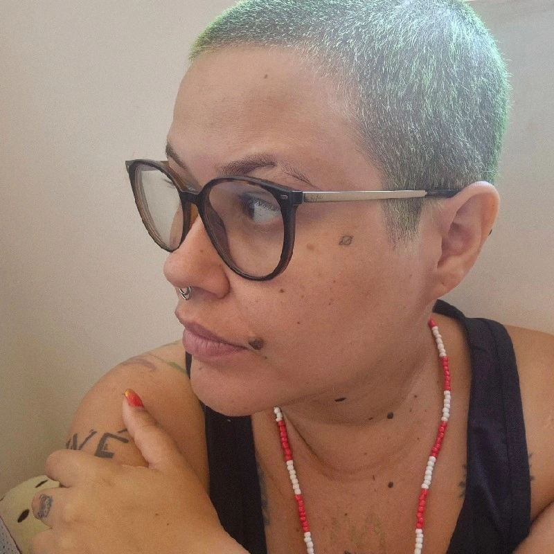
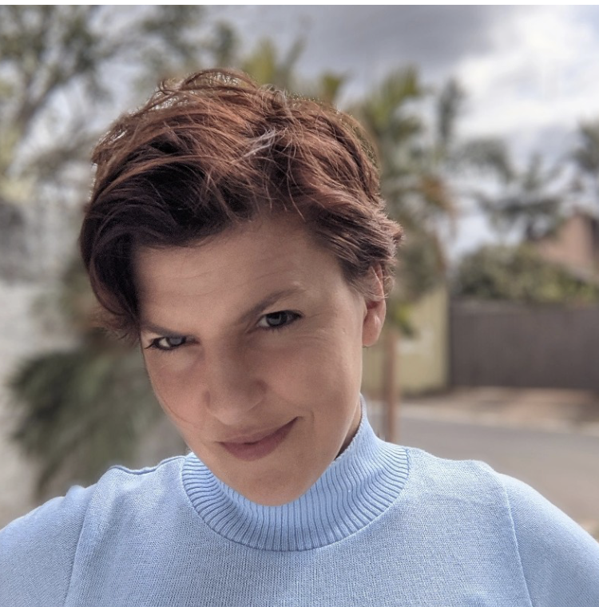

<picture>
  <source media="(prefers-color-scheme: dark)" srcset="../brand/identidade/logos/horizontal_creme_blue.png">
  <source media="(prefers-color-scheme: light)" srcset="../brand/identidade/logos/horizontal_black.png">
  
</picture>

# NOSS 2026 - Nosso Open Source Summit

> O Brasil já constrói open source. Agora é hora de estruturar os nós.

[🇺🇸 English Version](./README_EN.md)

## 📌 Sumário

- [O Evento](#-o-evento)
- [Como Assistir](#-como-assistir)
- [Quem Você Encontrará por Lá](#-quem-você-encontrará-por-lá)
- [Programação](#-programação)
- [Patrocinadores](#-patrocinadores)
- [Organizações Parceiras](#-organizações-parceiras)
- [Voluntariado](#-voluntariado)
- [Perguntas Frequentes](#-perguntas-frequentes)
- [Contato](#-contato)

## 🎉 O Evento

**NOSS 2026** é a primeira edição do Nosso Open Source Summit - um encontro aberto sobre **FLOSS (Free/Libre and Open Source Software)** no Brasil.

Reunimos pessoas que constroem, mantêm e querem entrar no ecossistema de tecnologias abertas para compartilhar experiências, fortalecer projetos e criar comunidade.

| | |
|---|---|
| 📅 **Data** | 30 de maio de 2026 |
| ⏰ **Horário** | 09:30 – 18:30 (BRT) |
| 📍 **Formato** | Online e gratuito |
| 📺 **Onde assistir** | [YouTube/@CumbucaDev](https://www.youtube.com/@CumbucaDev) |

👉 Para entender o contexto completo, motivações e visão do projeto: [README principal](../README.md)

## 📺 Como Assistir

O evento será transmitido ao vivo pelo YouTube, gratuitamente, em duas trilhas simultâneas:

* **🟣 [Trilha principal - FLOSS na prática](https://www.youtube.com/watch?v=2GLyGSolizQ)**
Conteúdo técnico e avançado: keynotes, palestras, painel de encerramento.

* **🔵 Trilha Iniciante - Fundamentos em FLOSS**
Trilha introdutória para quem está começando no ecossistema open source. _Link disponível próximo à data do evento._

Não precisa se inscrever - é só entrar e assistir.

> **E se o projeto fizer sentido para você, deixa um like na**
> **[live](https://www.youtube.com/watch?v=2GLyGSolizQ)!**
> **Isso ajuda muito o YouTube a recomendar o evento para mais pessoas e fortalece a divulgação de**
> **iniciativas open source brasileiras 💜**

As gravações ficarão disponíveis após o evento.

## 🌟 Quem Você Encontrará por Lá

<table>
  <tr>
    <td align="center" width="100">
      <a href="./pessoas/anna-e-so.md">
         
        <b>Anna e Só</b>
      </a>
    </td>
    <td align="center" width="100">
      <a href="./pessoas/carla-rocha.md">
         
        <b>Carla Rocha</b>
      </a>
    </td>
    <td align="center" width="100">
      <a href="./pessoas/carlos-becker.md">
         
        <b>Carlos Becker</b>
      </a>
    </td>
    <td align="center" width="100">
      <a href="./pessoas/cuducos.md">
         
        <b>Cuducos</b>
      </a>
    </td>
    <td align="center" width="100">
      <a href="./pessoas/felipython.md">
         
        <b>FeliPython</b>
      </a>
    </td>
    <td align="center" width="100">
      <a href="./pessoas/hisham-muhammad.md">
         
        <b>Hisham Muhammad</b>
      </a>
    </td>
    <td align="center" width="100">
      <a href="./pessoas/maite.md">
         
        <b>Maitê</b>
      </a>
    </td>
    <td align="center" width="100">
      <a href="./pessoas/mario-sergio.md">
         
        <b>Mário Sérgio</b>
      </a>
    </td>
  </tr>
  <tr>
    <td align="center" width="100">
      <a href="./pessoas/mateus-roveda.md">
         
        <b>Mateus Roveda</b>
      </a>
    </td>
    <td align="center" width="100">
      <a href="./pessoas/melissawm.md">
         
        <b>MelissaWM</b>
      </a>
    </td>
    <td align="center" width="100">
      <a href="./pessoas/mr-enderson.md">
         
        <b>Mr Enderson</b>
      </a>
    </td>
    <td align="center" width="100">
      <a href="./pessoas/nick-vidal.md">
         
        <b>Nick Vidal</b>
      </a>
    </td>
    <td align="center" width="100">
      <a href="./pessoas/pachi-parra.md">
         
        <b>Pachi Parra</b>
      </a>
    </td>
    <td align="center" width="100">
      <a href="./pessoas/paloma-oliveira.md">
         
        <b>Paloma Oliveira</b>
      </a>
    </td>
    <td align="center" width="100">
      <a href="./pessoas/yaso.md">
         
        <b>Yaso</b>
      </a>
    </td>
  </tr>
</table>

## 📅 Programação

Veja a programação detalhada em [grade_completa.md](./grade_completa.md)

## 💎 Patrocinadores

O NOSS 2026 é viabilizado pelo apoio de organizações que acreditam no ecossistema open source brasileiro.

<!-- PLACEHOLDER: adicionar patrocinadores à medida que forem confirmados -->
<!-- Formato sugerido por nível:

### 🥇 Ouro

### 🥈 Prata

### 🥉 Bronze

### Apoio Institucional

-->

*Patrocinadores serão anunciados em breve.*

👉 Organizações interessadas em apoiar o evento podem acessar a proposta de patrocínio: [proposta-patrocinio.md](./proposta-patrocinio.md)

## 🤜🤛 Organizações Parceiras

O NOSS é construído em colaboração com comunidades, organizações e iniciativas que fortalecem o ecossistema de FLOSS no Brasil e no mundo.

<table>
  <tr>
    <td align="center" width="180">
      <a href="https://opensource.org/">
         
        <b>Open Source Initiative</b>
      </a>
    </td>
    <td align="center" width="180">
      <a href="https://ulivre.dev/">
         
        <b>Universidade Brasileira Livre</b>
      </a>
    </td>
    <td align="center" width="180">
      <a href="https://python.floripa.br/">
         
        <b>Python Floripa</b>
      </a>
    </td>
    <td align="center" width="180">
      <a href="https://tech.floripa.br/">
         
        <b>Tech Floripa</b>
      </a>
    </td>
  </tr>
</table>

Detalhes sobre cada organização: [organizacoes_parceiras.md](./organizacoes_parceiras.md)

> Quer que sua comunidade ou organização faça parte? 📧 <eventos@cumbuca.dev> - Assunto: `Parceria NOSS 2026`

## 🤝 Voluntariado

O evento é construído com a participação de pessoas voluntárias. Você pode contribuir em diferentes frentes:

- **Organização** - suporte à equipe central
- **Comunicação** - divulgação e redes sociais
- **Moderação de chat** - durante as transmissões ao vivo
- **Apoio técnico** - infraestrutura de streaming

📧 <eventos@cumbuca.dev> - Assunto: `Voluntariado NOSS`

## ❓ Perguntas Frequentes

* **O evento é pago?** Não. O NOSS 2026 é totalmente gratuito e aberto.
* **Preciso me inscrever para assistir?** Não. É só acessar o YouTube da Cumbuca Dev no dia 30/05.
* **As gravações ficarão disponíveis?** Sim. As gravações serão publicadas no canal após o evento.
* **Haverá certificado de participação?** Sim. Iremos gerar certificados de participação. Para receber o certificado, será necessário realizar um check-in no dia do evento. Mais detalhes serão explicados durante a transmissão.
* **Posso submeter uma palestra mesmo sendo iniciante?** Sim! A trilha Fundamentos em FLOSS é voltada exatamente para quem está começando e aceita conteúdos introdutórios.
* **O evento tem código de conduta?** Sim. Todo participante deve seguir o [Código de Conduta](../CODE_OF_CONDUCT.md).
* **Como posso contribuir com o repositório?** Leia o [CONTRIBUTING.md](../CONTRIBUTING.md) para saber como contribuir com a documentação e organização do evento.

## 📌 Contato

* 📧 <eventos@cumbuca.dev>
* 💬 [Discussões no GitHub](https://github.com/cumbucadev/NOSS/discussions)
* 🌐 [cumbuca.dev](https://cumbuca.dev)

Criado e organizado com 💜 pela [Cumbuca Dev](https://cumbuca.dev)
