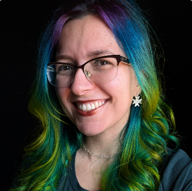

<picture>
  <source media="(prefers-color-scheme: dark)" srcset="../brand/identidade/logos/horizontal_creme_blue.png">
  <source media="(prefers-color-scheme: light)" srcset="../brand/identidade/logos/horizontal_black.png">
  
</picture>

# NOSS 2026 - Nosso Open Source Summit

> Brazil is already building open source. Now it's time to structure the nodes.

[🇧🇷 Versão em Português](./README.md)

## 📌 Table of Contents

- [The Event](#-the-event)
- [How to Watch](#-how-to-watch)
- [Who You'll Meet There](#-who-youll-meet-there)
- [Schedule](#-schedule)
- [Sponsors](#-sponsors)
- [Partner Organizations](#-partner-organizations)
- [Volunteering](#-volunteering)
- [Frequently Asked Questions](#-frequently-asked-questions)
- [Contact](#-contact)

## 🎉 The Event

**NOSS 2026** is the first edition of Nosso Open Source Summit - an open gathering about **FLOSS (Free/Libre and Open Source Software)** in Brazil.

We bring together people who build, maintain, and want to join the open technologies ecosystem to share experiences, strengthen projects, and create community.

| | |
|---|---|
| 📅 **Date** | May 30, 2026 |
| ⏰ **Time** | 09:30 – 18:30 (BRT) |
| 📍 **Format** | Online and free |
| 📺 **Where to watch** | [YouTube/@CumbucaDev](https://www.youtube.com/@CumbucaDev) |

👉 To understand the full context, motivations, and vision behind the project: [main README](../README.md)

## 📺 How to Watch

The event will be streamed live on YouTube, free of charge, across two simultaneous tracks:

* **🟣 [Main Track - FLOSS in Practice](https://www.youtube.com/watch?v=2GLyGSolizQ)**
Advanced and technical content: keynotes, talks, and closing panel.

* **🔵 Beginner Track - FLOSS Fundamentals**
Introductory track for people starting in the open source ecosystem. _Link available closer to the event date._

No registration is required - just join and watch.

> **And if the project resonates with you, leave a like on the**
> **[stream](https://www.youtube.com/watch?v=2GLyGSolizQ)!**
> **That really helps YouTube recommend the event to more people and strengthens the visibility of**
> **Brazilian open source initiatives 💜**

## 🌟 Who You'll Meet There

<table>
  <tr>
    <td align="center" width="100">
      <a href="./pessoas/anna-e-so.md">
         
        <b>Anna e Só</b>
      </a>
    </td>
    <td align="center" width="100">
      <a href="./pessoas/camis-moreira.md">
         
        <b>Camis Moreira</b>
      </a>
    </td>
    <td align="center" width="100">
      <a href="./pessoas/carla-rocha.md">
         
        <b>Carla Rocha</b>
      </a>
    </td>
    <td align="center" width="100">
      <a href="./pessoas/carlos-becker.md">
         
        <b>Carlos Becker</b>
      </a>
    </td>
    <td align="center" width="100">
      <a href="./pessoas/cuducos.md">
         
        <b>Cuducos</b>
      </a>
    </td>
    <td align="center" width="100">
      <a href="./pessoas/felipython.md">
         
        <b>FeliPython</b>
      </a>
    </td>
    <td align="center" width="100">
      <a href="./pessoas/eduardo-oliveira.md">
         
        <b>Eduardo Oliveira</b>
      </a>
    </td>
    <td align="center" width="100">
      <a href="./pessoas/hisham-muhammad.md">
         
        <b>Hisham Muhammad</b>
      </a>
    </td>
    <td align="center" width="100">
      <a href="./pessoas/maite.md">
         
        <b>Maitê</b>
      </a>
    </td>
    <td align="center" width="100">
      <a href="./pessoas/marylia-gutierrez.md">
         
        <b>Marylia Gutierrez</b>
      </a>
    </td>
    <td align="center" width="100">
      <a href="./pessoas/mario-sergio.md">
         
        <b>Mário Sérgio</b>
      </a>
    </td>
  </tr>
  <tr>
    <td align="center" width="100">
      <a href="./pessoas/mateus-roveda.md">
         
        <b>Mateus Roveda</b>
      </a>
    </td>
    <td align="center" width="100">
      <a href="./pessoas/melissawm.md">
         
        <b>MelissaWM</b>
      </a>
    </td>
    <td align="center" width="100">
      <a href="./pessoas/mr-enderson.md">
         
        <b>Mr Enderson</b>
      </a>
    </td>
    <td align="center" width="100">
      <a href="./pessoas/nick-vidal.md">
         
        <b>Nick Vidal</b>
      </a>
    </td>
    <td align="center" width="100">
      <a href="./pessoas/pachi-parra.md">
         
        <b>Pachi Parra</b>
      </a>
    </td>
    <td align="center" width="100">
      <a href="./pessoas/paloma-oliveira.md">
         
        <b>Paloma Oliveira</b>
      </a>
    </td>
    <td align="center" width="100">
      <a href="./pessoas/yaso.md">
         
        <b>Yaso</b>
      </a>
    </td>
  </tr>
</table>

## 📅 Schedule

See the detailed schedule in [grade_completa.md](./grade_completa.md)

## 💎 Sponsors

NOSS 2026 is made possible thanks to the support of organizations that believe in the Brazilian open source ecosystem.

<!-- PLACEHOLDER: add sponsors as they are confirmed -->
<!-- Suggested format by tier:-->

### 🥇 Gold

<!--
### 🥈 Silver

### 🥉 Bronze

### Institutional Support

-->

Organizations interested in supporting the event can access the sponsorship proposal: [sponsorship_proposal.md](./sponsorship_proposal.md)

## 🤜🤛 Partner Organizations

NOSS is built in collaboration with communities, organizations, and initiatives that strengthen the FLOSS ecosystem in Brazil and around the world.

<table>
  <tr>
    <td align="center" width="180">
      <a href="https://opensource.org/">
         
        <b>Open Source Initiative</b>
      </a>
    </td>
    <td align="center" width="180">
      <a href="https://ulivre.dev/">
         
        <b>Universidade Brasileira Livre</b>
      </a>
    </td>
    <td align="center" width="180">
      <a href="https://python.floripa.br/">
         
        <b>Python Floripa</b>
      </a>
    </td>
    <td align="center" width="180">
      <a href="https://tech.floripa.br/">
         
        <b>Tech Floripa</b>
      </a>
    </td>
  </tr>
</table>

Details about each organization: [organizacoes_parceiras.md](./organizacoes_parceiras.md)

> Want your community or organization to be part of it? 📧 <eventos@cumbuca.dev> - Subject: `NOSS 2026 Partnership`

## 🤝 Volunteering

The event is built with the participation of volunteers. You can contribute in different areas:

- **Organization** - support for the core team
- **Communication** - outreach and social media
- **Chat moderation** - during live streams
- **Technical support** - streaming infrastructure

📧 <eventos@cumbuca.dev> - Subject: `NOSS Volunteering`

## ❓ Frequently Asked Questions

* **Is the event paid?** No. NOSS 2026 is completely free and open.
* **Do I need to register to watch?** No. Just access the Cumbuca Dev YouTube channel on 05/30.
* **Will there be a participation certificate?** Yes. We will issue participation certificates. To receive one, you will need to complete a check-in during the event. More details will be explained during the livestream.
* **Can I submit a talk even if I’m a beginner?** Yes! The FLOSS Fundamentals track is specifically designed for people getting started and welcomes introductory content.
* **Does the event have a code of conduct?** Yes. Every participant must follow the [CODE_OF_CONDUCT.md](../CODE_OF_CONDUCT.md).
* **How can I contribute to the repository?** Read [CONTRIBUTING.md](../CONTRIBUTING.md) to learn how to contribute to the documentation and organization of the event.

## 📌 Contact

* 📧 <eventos@cumbuca.dev>
* 💬 [GitHub Discussions](https://github.com/cumbucadev/NOSS/discussions)
* 🌐 [cumbuca.dev](https://cumbuca.dev)

Created and organized with 💜 by [Cumbuca Dev](https://cumbuca.dev)
