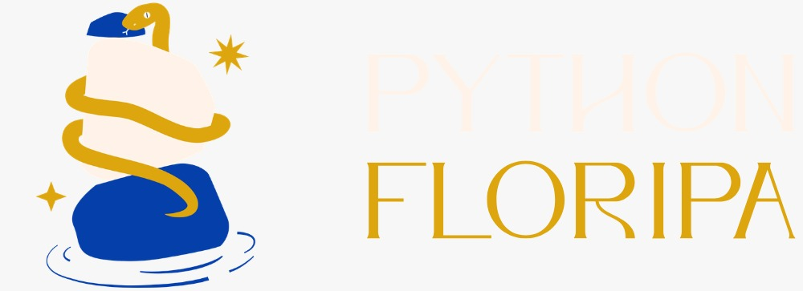
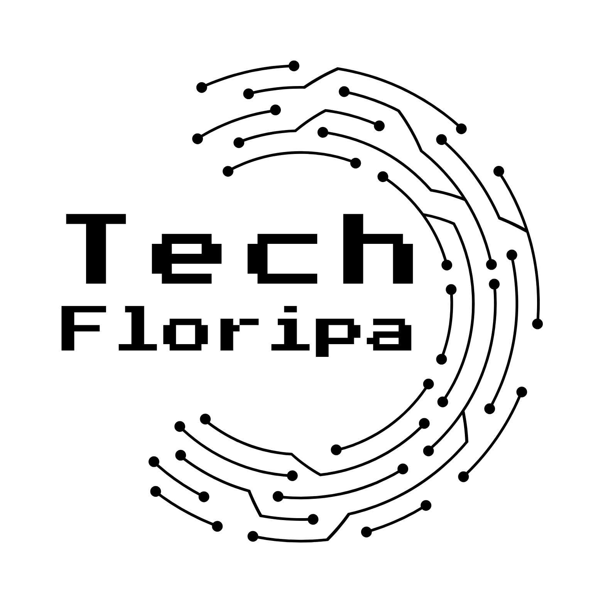

# 🤝 Organizações Parceiras — NOSS 2026

O NOSS está sendo construído em colaboração com comunidades, organizações e iniciativas que ajudam a fortalecer o ecossistema de FLOSS no Brasil e no mundo.

Essas organizações apoiam a ampliação de alcance do evento, circulação de conhecimento e fortalecimento das conexões dentro do open source.

---

## 🌱 Ecossistema conectado

As organizações parceiras do NOSS somam comunidades, projetos e iniciativas que alcançam milhares de pessoas no Brasil e internacionalmente, fortalecendo a circulação de conhecimento, colaboração e participação no ecossistema de FLOSS.

---

# 🌍 Organizações confirmadas

---

## Open Source Initiative (OSI)

  <picture>
    <source
      media="(prefers-color-scheme: dark)"
      srcset="https://i0.wp.com/opensource.org/wp-content/uploads/2023/03/cropped-OSI-horizontal-large.png?fit=640%2C229&quality=80&ssl=1"
    >
    
  </picture>

 

**Atuação:** Organização global dedicada à promoção e proteção do open source

**Localização:** Global / Estados Unidos

A Open Source Initiative é uma das principais organizações globais do ecossistema de open source e atua diretamente na definição, promoção e proteção do conceito de Open Source Software.

O NOSS contará com participação confirmada de representante da OSI na programação do evento.

🔗 https://opensource.org/

## Universidade Brasileira Livre (UBL)

  <picture>
    <source
      media="(prefers-color-scheme: dark)"
      srcset="https://github.com/Universidade-Livre/imagens/blob/main/logos/PNG/Logo-sem-fundo-padr%C3%A3o/LOGO-UBL-SEM-FUNDO-09.png?raw=true"
    >
    
  </picture>

 

**Atuação:** Organização brasileira dedicada ao apoio de estudantes de todos os níveis que ajudam uns aos outros e compartilham suas experiências e conhecimentos em torno de diferentes currículos de código aberto.

**Localização:** Brasil (remoto)

A Universidade Livre Brasileira é um projeto inspirado na Open Source Society University (OSSU). É uma comunidade sem fins lucrativos de apoio de estudantes de todos os níveis que ajudam uns aos outros e compartilham suas experiências e conhecimentos em torno de diferentes currículos de código aberto. 

O NOSS contará com participação confirmada de representante da UBL na programação do evento.

🔗 https://ulivre.dev/

## Python Floripa

    

 

**Atuação:** Comunidade regional que reúne pessoas interessadas em Python, tecnologia e inovação por meio de encontros mensais de troca de conhecimento e conexões.

**Localização:** Florianópolis, Brasil 

A Python Floripa é uma comunidade regional que reúne entusiastas da linguagem Python em encontros mensais voltados à troca de conhecimento, networking e fortalecimento do ecossistema de tecnologia da Grande Florianópolis. Mais do que uma comunidade sobre uma linguagem, é um espaço de conexão entre pessoas, ideias e iniciativas do mundo tech.

No NOSS, a Python Floripa participará com uma Palestra ao vivo no formato híbrido - enquanto acontece o 96° meetup da comunidade no mesmo dia.

🔗 https://python.floripa.br/

## Tech Floripa

  <picture>
    <source
      media="(prefers-color-scheme: dark)"
      srcset="assets/images/tech_floripa_black_background.jpeg"
    >
    <source
      media="(prefers-color-scheme: light)"
      srcset="assets/images/tech_floripa_white_background.jpeg"
    >
    
  </picture>

 

**Atuação:** Hub regional que apoia, organiza e conecta eventos, comunidades, empresas e oportunidades do ecossistema de tecnologia da Grande Florianópolis.

**Localização:** Florianópolis, Brasil

A Tech Floripa é um hub de eventos de tecnologia de Florianópolis e região, criado para fortalecer comunidades, produtores de eventos e iniciativas ligadas ao ecossistema de inovação. A plataforma apoia a divulgação de eventos, a gestão de inscrições, o controle de participantes e a emissão de certificados, além de conectar organizadores a espaços, apoiadores, patrocinadores, empresas, oportunidades de mercado e outros agentes estratégicos da comunidade tech.

No NOSS, a Tech Floripa participa da gestão do evento, atuando na organização das inscrições, na emissão de certificados e na realização de sorteios.

🔗 https://tech.floripa.br/

## ProGirls

 
    
  </picture>

 

**Atuação:** Comunidade global dedicada ao apoio, capacitação e fortalecimento de mulheres na tecnologia.

**Localização:** Online / Global

A ProGirls é uma comunidade criada para conectar, apoiar e impulsionar mulheres no mundo da tecnologia, promovendo oportunidades de aprendizado, networking e crescimento profissional para participantes de diferentes lugares do mundo.

A comunidade desenvolve iniciativas voltadas à educação e inclusão no setor tech, incluindo mentorias, treinamentos, workshops, projetos colaborativos e ações de voluntariado.

Atualmente, a ProGirls reúne:

* +4 mil mulheres conectadas no LinkedIn
* +1 mil participantes em grupos e comunidades
* Rede ativa de voluntariado e apoio
* Projetos, mentorias e workshops voltados à tecnologia e carreira

A proposta da comunidade é criar um ambiente acessível, acolhedor e colaborativo para fortalecer a presença feminina na tecnologia e gerar impacto positivo no ecossistema.

O NOSS contará com a parceria de divulgação e engajamento da ProGirls.

🔗 https://www.progirls.com.br/