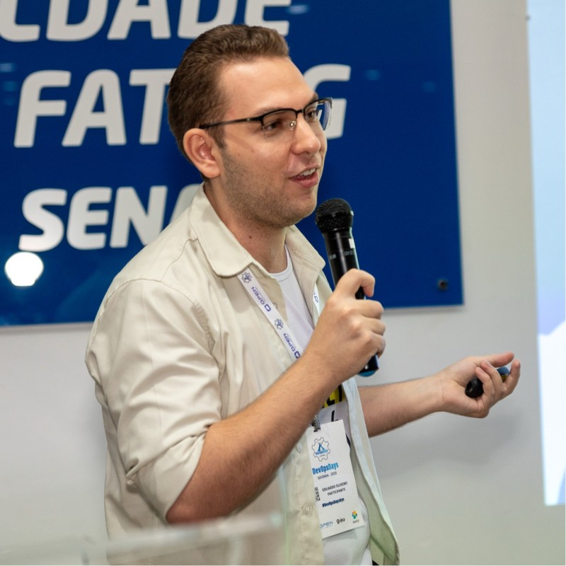

# Anna e Só

## 📌 Informações

- **Pronomes:** ele/dele - he/him
- **LinkedIn:** https://www.linkedin.com/in/edujso/
- **GitHub:** https://github.com/EduardoJM/

## 🧠 Bio

Sou o Eduardo, Desenvolvedor FullStack, Autista com diagnóstico tardio. Sou Licenciado em Matemática. Durante a graduação fiz pesquisa em Matemática Aplicada e Computacional. Transicionei de carreira durante a pandemia e desde o começo da carreira atuo em startup's e empresas pequenas. Atualmente, participo, também, da organização da comunidade Portera Tech. Fora do trabalho, gosto de ler, jogar videogame e escrever.

## 🎤 Atividades

- [Contribuindo para o Open-Source sendo uma pessoa comum](../atividades/contribuindo-para-o-open-source-sendo-uma-pessoa-comum.md)
