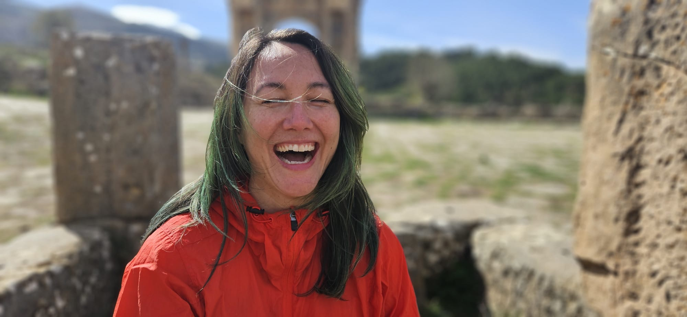

# Paloma Oliveira

## 📌 Informações

- **Pronomes:** ela/dela - she/her
- **LinkedIn:** https://www.linkedin.com/in/discombobulateme/
- **GitHub:** https://github.com/discombobulateme

## 🧠 Bio

Como tecnologista da Sovereign Tech Agency, contribuo para a definição de infraestruturas digitais abertas essenciais para a soberania digital global, bem como seu fortalecimento através de investimentos diretos e diversos programas.

Engajada na exploração crítica das intersecções entre arte, tecnologia, minha perspectiva é socio-técnica-ecológica: tecnologia não é neutra, e as escolhas sobre quem a mantém, como é governada e por quem é acessada têm consequências profundas para a autonomia coletiva, incluindo não humanos. Envolvida na governança e organização de comunidades FOSS como membra do conselho do Python Software Verband, integrante de program committees da Open JS Foundation, FOSS Backstage e PyCon DE & PyData, e organizadora das PyLadies Alemanha, co-fundadora do Zentrum für Netzkunst (centro para a net arte), onde esse compromisso com tecnologia, equidade e cuidado encontra sua dimensão cultural e artística.

## 🎤 Atividades

- [A infraestrutura digital é global, e o Brasil faz parte dela](../atividades/a-infraestrutura-digital-e-global-e-o-brasil-faz-parte-dela.md)
