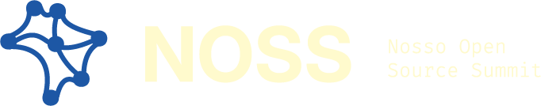

<div align="center">
  <picture>
    <source
      media="(prefers-color-scheme: dark)"
      srcset="brand/identidade/logos/horizontal_creme_blue.png"
    >
    
  </picture>


O Brasil já constrói open source. Agora é hora de criar e fortalecer os nós.


<div>

### [NOSS 2026](/2026/README.md) - 30 de maio - Evento Remoto - [Youtube/@CumbucaDev](https://www.youtube.com/watch?v=2GLyGSolizQ)

</div>

[English Version](/README_EN.md)

<div align='left'>

## 📚 Sumário

- [Sobre](#-sobre)
- [Sustentabilidade como eixo central](#-sustentabilidade-como-eixo-central)
- [O Brasil nesse cenário](#-o-brasil-nesse-cenário)
- [Soberania e capacidade de construção](#-soberania-e-capacidade-de-construção)
- [Origem e continuidade](#-origem-e-continuidade)
- [Por que Maio](#por-que-maio)
- [O que estamos construindo](#-o-que-estamos-construindo)
- [FLOSS também é sobre viver disso](#-floss-também-é-sobre-viver-disso)
- [Referências](#-referências)
- [Diversidade e acesso](#-diversidade-e-acesso)
- [Estrutura aberta](#-estrutura-aberta)
- [Por que NOSS](#-por-que-noss)

---

## 🧾 Sobre

O NOSS nasce de um incômodo, que acompanha um sonho.

Vivemos em um mundo sustentado por tecnologias abertas. Ainda assim, as pessoas que mantêm esse ecossistema seguem, muitas vezes, invisíveis, sobrecarregadas e pouco conectadas entre si.

No Brasil, isso é ainda mais evidente.

Tem muita gente boa construindo coisas relevantes, participando de projetos globais, criando soluções que impactam outras pessoas. Mas ainda com pouca visibilidade, pouca articulação e poucas oportunidades reais de retorno.

O NOSS existe para aproximar esses pontos. Não apenas como evento, mas como um espaço de conexão.

---

## 🌱 Sustentabilidade como eixo central

A discussão sobre open source ainda é, em grande parte, conduzida a partir de uma lógica de contribuição. Essa lógica é importante, mas insuficiente.

Sem sustentabilidade, projetos não se mantêm. Sem manutenção, não há continuidade. E sem continuidade, não existe ecossistema.

Falar de [FLOSS](https://flusp.ime.usp.br/floss/) no Brasil exige incorporar, de forma explícita, dimensões como renda, financiamento, distribuição de valor e condições reais de permanência. Não como exceção, mas como parte do modelo.

Esse é um ponto central, especialmente em contextos onde desigualdades estruturais impactam diretamente quem consegue entrar, permanecer e se desenvolver na área.

---

## 🇧🇷 O Brasil nesse cenário


O Brasil já participa desse ecossistema em escala relevante. Dados públicos, como o GitHub Octoverse e relatórios de pesquisa do próprio GitHub, indicam crescimento consistente da comunidade brasileira em volume de pessoas desenvolvedoras e contribuições.

No entanto, essa participação não se traduz, na mesma proporção, em capacidade de captura de valor.

Há uma distância evidente entre contribuir e estruturar, entre participar e liderar, entre produzir tecnologia e transformar essa produção em renda, continuidade e influência.

Na prática, isso se manifesta de forma recorrente: pessoas entram no ecossistema, mas não encontram condições para permanecer nele de forma sustentável. Quando encontram, muitas vezes isso acontece fora do país.

Referências:

* [GitHub Octoverse](https://octoverse.github.com/)

* [GitHub Research](https://github.blog/news-insights/research/)  

* [Stack Overflow Developer Survey](https://survey.stackoverflow.co/)
  

O problema não é capacidade técnica. É conexão, visibilidade e acesso.

---

## 👑 Soberania e capacidade de construção

A discussão sobre soberania tecnológica costuma ser reduzida à infraestrutura ou à capacidade de consumo. No entanto, ela também envolve a capacidade de manter, evoluir e sustentar tecnologias ao longo do tempo.

Um país que apenas consome tecnologia depende. Um país que apenas contribui, mas não estrutura, continua dependente.

Fortalecer o ecossistema de open source no Brasil implica criar condições para que pessoas e projetos possam se desenvolver localmente, com continuidade e reconhecimento. Isso passa, necessariamente, por organização, articulação e construção de rede.

---

## 🌳 Origem e continuidade

A Cumbuca Dev já atua diretamente na criação de caminhos de entrada para tecnologia, com foco em acesso, formação e comunidade.

Na prática, isso significa trabalhar com pessoas que estão começando e acompanhar de perto os pontos de ruptura desse processo. Um deles aparece de forma consistente: entrar é possível; permanecer e crescer ainda não é garantido.

O NOSS surge como continuidade desse trabalho, ampliando o foco para um outro nível do ecossistema: articulação, visibilidade e sustentabilidade dentro do open source.

Não se trata de iniciar algo isolado, mas de organizar algo que já existe de forma dispersa.

---

<h2 id="por-que-maio">🗓️ Por que Maio</h2>

Maio tem sido reconhecido internacionalmente como o mês de valorização de pessoas mantenedoras (Maintainer Month).

* [GitHub](https://maintainermonth.github.com/) 
* [OSI](https://opensource.org/blog/may-is-maintainer-month-celebrating-those-who-secure-open-source)

São essas pessoas que sustentam o ecossistema no dia a dia. Mesmo assim, muitas vezes trabalham com pouca visibilidade, pouco reconhecimento e poucos recursos.

No Brasil, esse cenário se soma a outros desafios:

* menos financiamento
* menor inserção internacional
* maior dependência de trabalho voluntário

Escolher maio é uma decisão intencional: queremos colocar o foco em quem mantém esses projetos.

---

## 🚀 O que estamos construindo

O NOSS é o primeiro passo para a criação um ponto de encontro do ecossistema de FLOSS no Brasil.

Um espaço para:

* aproximar pessoas e comunidades
* dar visibilidade a projetos e pessoas mantenedoras
* compartilhar experiências técnicas reais
* apoiar quem está começando
* fortalecer quem já está construindo

---

## 💰 FLOSS também é sobre viver disso

Open source costuma ser associado a:

* portfólio
* aprendizado
* contribuição voluntária - geralmente depois de um certo nível de carreira

Mas vai muito além disso...

FLOSS também pode ser:

* fonte de renda
* oportunidade profissional
* construção de reputação
* possibilidade real de uma vida com código e propósito

Contribuir é importante.

Sustentar quem contribui é essencial.

---

## 🌍 Referências

O NOSS se inspira e dialoga com iniciativas consolidadas no ecossistema global:

* All Things Open
  https://allthingsopen.org/

* Open Source Initiative
  https://opensource.org/

* Linux Foundation
  https://www.linuxfoundation.org/

* Python Software Foundation
  https://www.python.org/psf/

---

## 🌱 Diversidade e acesso

Falar de open source no Brasil é falar de quem consegue entrar e permanecer.

E a gente sabe que esse acesso não é igual.

Por isso, o NOSS carrega o mesmo compromisso que a Cumbuca Dev já constrói:

* ampliar acesso
* dar visibilidade a trajetórias diversas
* reduzir barreiras reais
* construir um espaço seguro para todas as pessoas

---

## 🔓 Estrutura aberta

Este projeto é aberto.

Isso significa:

* documentação pública
* construção coletiva
* possibilidade de replicação

Qualquer pessoa ou comunidade pode adaptar esse modelo e construir novas edições.

---

## 🧩 Estrutura do repositório

```
/docs   → documentos estruturais  
/2026   → edição atual  
/brand  → identidade visual  
```

👉 Detalhes da edição atual:
[/2026/README.md](2026/README.md) 

---

## 💰 Sustentabilidade

O evento é gratuito.

Os recursos arrecadados são utilizados para:

* execução do evento
* qualidade técnica
* fortalecimento da comunidade
* continuidade das iniciativas
* apoio à comunidades do ecossistema

Não há distribuição de lucro individual.

---

## 🪢 Por que NOSS

O nome não é apenas uma escolha estética.

“NOSS” carrega duas camadas de significado que se complementam.

A primeira é direta: **Nosso Open Source Summit**. Um espaço que não pertence a uma única organização, que é construído coletivamente, por diferentes pessoas, comunidades e iniciativas — que representa e pertence a todas as pessoas, e que nos une ao criar conexões — ao criar nós.

A segunda é estrutural: **nós**.

Não apenas como metáfora, mas como condição de existência de qualquer ecossistema. Open source não se sustenta apenas com código. Ele se sustenta com relações, continuidade e articulação entre quem constrói, quem mantém, quem aprende e quem depende dessa infraestrutura.

O problema que enfrentamos hoje não é ausência de tecnologia. É a ausência dessas conexões de forma estruturada.

O NOSS existe para organizar esses nós.

Para aproximar pessoas que hoje operam de forma isolada.
Para dar visibilidade a quem mantém.
Para conectar contribuição com oportunidade.
Para transformar participação em permanência.

Esse movimento não começa aqui.

Ele já acontece na prática, dentro de comunidades e projetos que atuam criando caminhos de entrada e formação. O NOSS organiza o próximo passo: estruturar continuidade, articulação e sustentabilidade.

Se o open source sustenta o mundo, o NOSS parte de uma premissa simples: o ecossistema brasileiro também precisa se sustentar.

E isso só acontece quando existe rede.

Quando existe conexão.

Quando existem nós.


---
<div align="center">

Criado e organizado com 💜 pela [Cumbuca Dev](https://cumbuca.dev)

</div>

## 📌 Contato

[eventos@cumbuca.dev](mailto:eventos@cumbuca.dev)

---

## 💻 Contribuindo

Leia:

* [CONTRIBUTING.md](/CONTRIBUTING.md)
* [CODE_OF_CONDUCT.md](/CODE_OF_CONDUCT.md)
* [VISION.md](/VISION.md)

---

## 💬 Discussões

https://github.com/cumbucadev/NOSS/discussions

---


## ❤️ Pessoas que contribuem

<a href="https://github.com/cumbucadev/NOSS/graphs/contributors">
  
</a>

---
